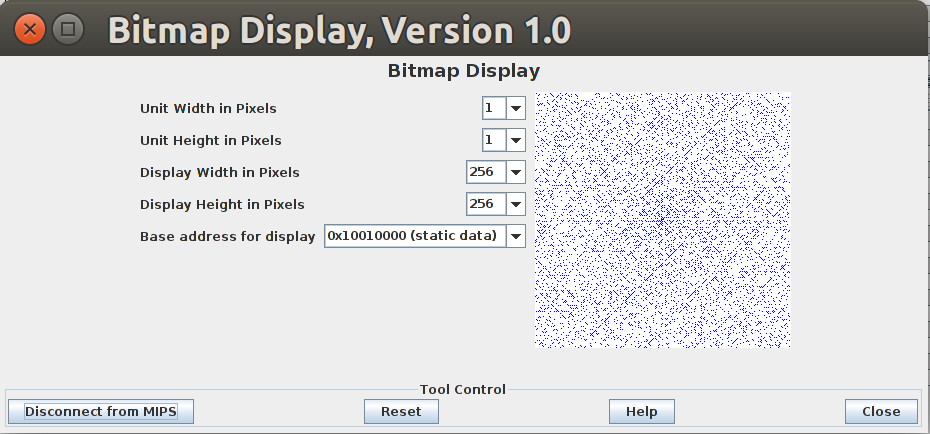

# Ulam's Spiral

*Program contains subroutines for:*

* clearing the BitMap Display
* clearing a block of memory
* calculating primes
* displaying [Ulam's Spiral](http://mathworld.wolfram.com/PrimeSpiral.html)

All primes up to 65025 are shown.

###Instructions for use:

* open program with [Mars](http://courses.missouristate.edu/KenVollmar/mars/download.htm)
* click Tools -> Bitmap Display -> Connect to MIPS
* configure Bitmap Display as pictured
* assemble the file
* run the program
